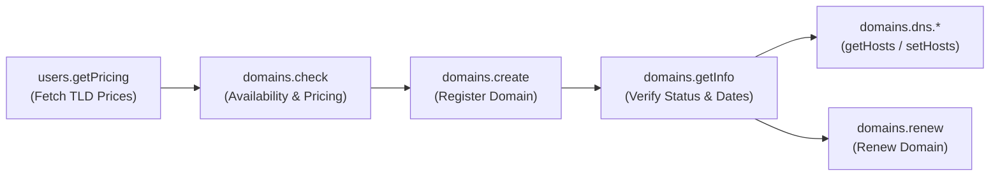

# Namecheap API Documentation

Official Namecheap API reference and integration guide for Prohor.

---

## Endpoints

| Environment | URL Endpoint |
| :--- | :--- |
| **Production** | `https://api.namecheap.com/xml.response` |
| **Sandbox** | `https://api.sandbox.namecheap.com/xml.response` |

---

## Key API Methods for Prohor

The core domain lifecycle and DNS management workflow follows:



1. **[Global Parameters & Authentication](file:///root/domains.prohor.dev/docs/namecheap/global-parameters.md)**: Mandatory authentication headers / query params (`ApiUser`, `ApiKey`, `UserName`, `ClientIp`, `Command`).
2. **[domains.check](file:///root/domains.prohor.dev/docs/namecheap/domains-check.md)**: Check availability and premium pricing for single or multiple domains.
3. **[domains.create](file:///root/domains.prohor.dev/docs/namecheap/domains-create.md)**: Register a domain name with registrant and DNS info.
4. **[domains.renew](file:///root/domains.prohor.dev/docs/namecheap/domains-renew.md)**: Renew an existing domain registration.
5. **[domains.getInfo](file:///root/domains.prohor.dev/docs/namecheap/domains-get-info.md)**: Retrieve comprehensive domain information, expiration dates, lock status, and nameservers.
6. **[domains.dns.*](file:///root/domains.prohor.dev/docs/namecheap/domains-dns.md)**: Manage DNS records (`getHosts`, `setHosts`, `setCustom`, `setDefault`).
7. **[users.getPricing](file:///root/domains.prohor.dev/docs/namecheap/users-get-pricing.md)**: Retrieve TLD pricing matrices for registration, renewal, and transfer.
8. **[Error Codes Reference](file:///root/domains.prohor.dev/docs/namecheap/error-codes.md)**: Full catalog of API error codes and troubleshooting guidelines.

---

## Response Structure

All Namecheap API responses are returned as XML with the root tag `<ApiResponse>`.

```xml
<?xml version="1.0" encoding="utf-8"?>
<ApiResponse xmlns="http://api.namecheap.com/xml.response" Status="OK">
  <Errors />
  <Warnings />
  <RequestedCommand>namecheap.domains.check</RequestedCommand>
  <CommandResponse Type="namecheap.domains.check">
    <!-- Method specific payload -->
  </CommandResponse>
  <Server>PHX01APIEXT02</Server>
  <GMTTimeDifference>--4:00</GMTTimeDifference>
  <ExecutionTime>0.045</ExecutionTime>
</ApiResponse>
```
